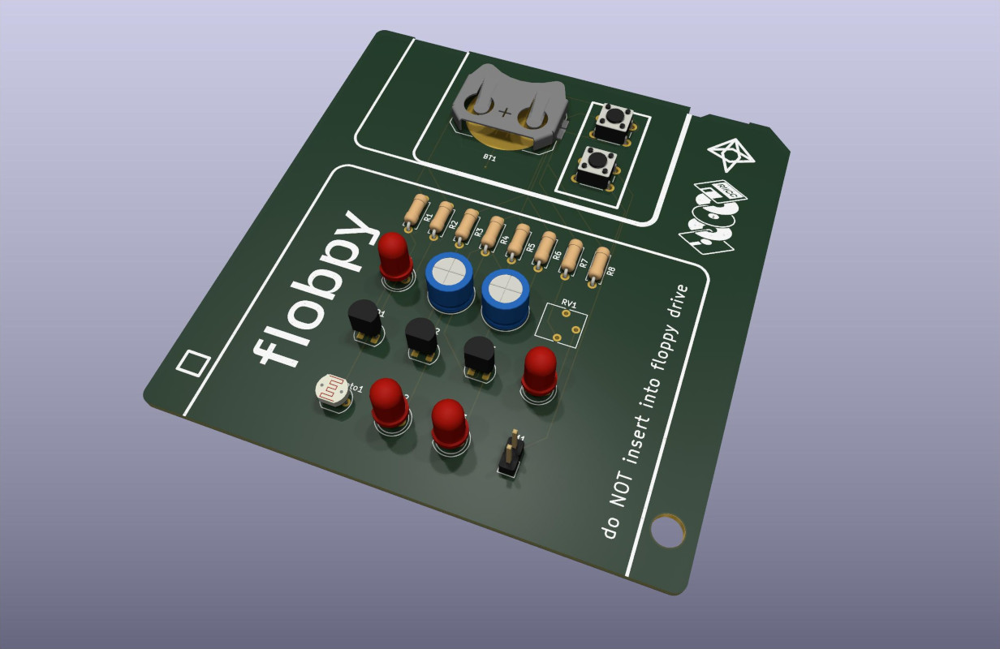
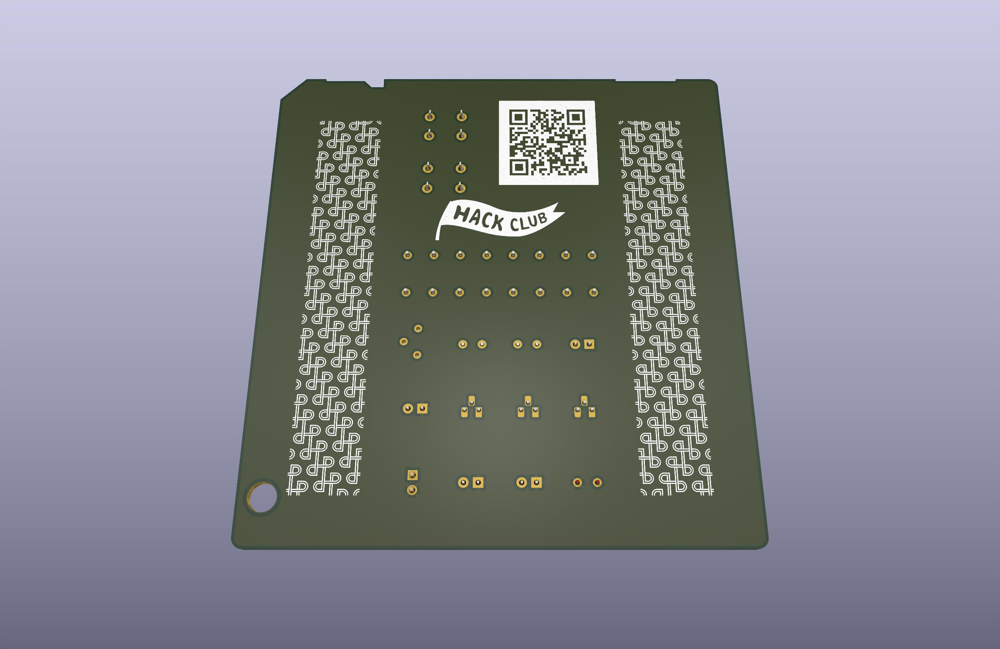
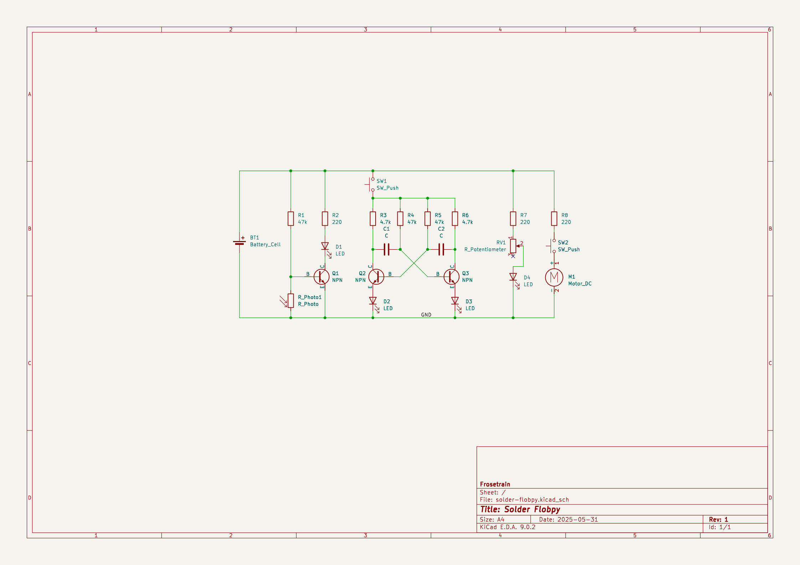
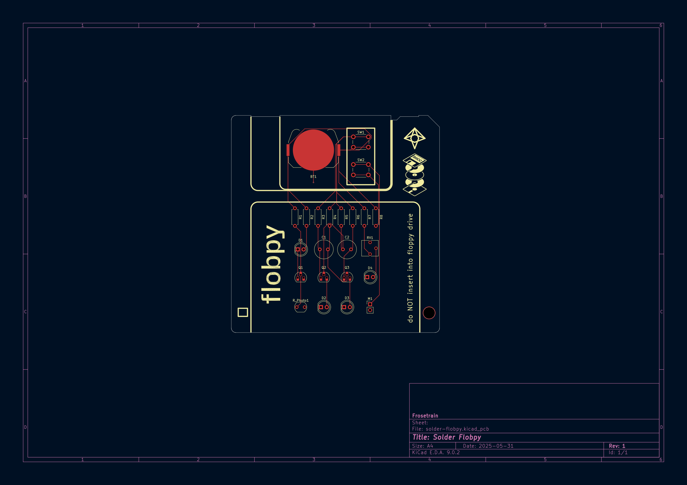
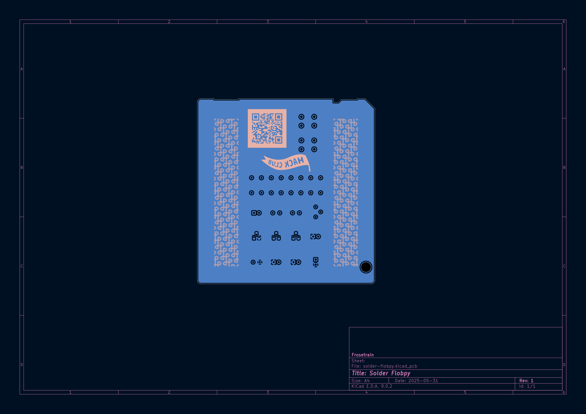

# Flobpy

I made a PCB that is the exact shape as a floppy disk, with some interactive components.

Slack username: `frosetrain`

Made for https://solder.hackclub.com

## Features

### Night light

The first LED lights up when the surrounding brightness is below a certain threshold. It uses a photoresistor and NPN transistor.

### Astable Multivibrator

This uses four resistors, two capacitors and two NPN transistors. This circuit makes the two LEDs flash in an alternating pattern. (I got this circuit idea from Falstad’s Circuit JS)

### Dimmable LED

It’s just a potentiometer.

### Motor disc

With the push of a button, the thing vibrates!

## The Story

I initially wanted to make a PCB in the shape of a floppy disk. To do this, I needed an accurate vector image of a floppy disk to add to KiCad. I could _not_ find one (everything online was a goofy emoji). So I painstakingly went through ECMA 147, the standard that defines floppy disks, and drew everything exactly in Inkscape.

For the logic, I was unfamiliar with how transistors worked, but thankfully Falstad’s Circuit JS allowed me to learn how it worked, and design my own circuit.

I decided to use a ground fill only on the back side. Maybe it should have been both sides.

I also added some lines to make it look like a floppy disk, and added some other text and images 👍

## Bill of Materials

- 1 battery holder
- 2 10µF capacitors
- 4 LEDs
- 1 mini motor disc
- 3 NPN transistors
- 3 220 resistors
- 2 4.7k resistors
- 3 47k resistors
- 1 potentiometer
- 1 LDR
- 2 push buttons

## Schematic

## PCB

